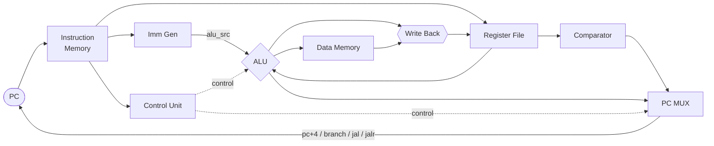

# RISC-V Single-Cycle Processor

> **RV32I 기반 Single-Cycle RISC-V 프로세서** — Verilog로 직접 설계하고 검증한 CPU 프로젝트


RV32I 명령어 집합을 기반으로 **Single-Cycle RISC-V 프로세서**를 Verilog로 설계했습니다.
명령어/데이터 메모리를 분리한 **하버드 구조**로 Fetch와 메모리 접근을 병렬화했으며,
7개 명령어 타입 전체에 대한 파형 검증과 어셈블리 프로그램 실행으로 기능 정합성을 확인했습니다.

---

## Highlights

- **RV32I ISA 전체 구현** — R · I · IL · S · B · U · J **7개 타입** 지원
- **하버드 구조 설계** — 명령어/데이터 메모리 분리로 Fetch·메모리 접근 병렬화
- **검증 완료** — 타입별 파형 검증 + 어셈블리 실행(1~10 누적합) **결과값 55 확인**
- **엔지니어링 트러블슈팅** — JALR 타깃 주소 정렬 버그를 원인 분석 후 해결

---

## Architecture



| 블록 | 역할 |
|------|------|
| **Control Unit** | `opcode`·`funct3`·`funct7` 디코딩 → 제어신호 생성 |
| **alu_src MUX** | ALU 입력을 레지스터 값 / immediate 중 선택 |
| **Comparator** | 분기(branch) 조건 판정 |
| **PC MUX** | 다음 PC 경로 선택 (`pc+4` / `branch` / `jal` / `jalr`) |

---

## Instruction Types (RV32I)

| Type | 설명 | 대표 명령어 |
|:----:|------|------------|
| **R**  | 레지스터-레지스터 연산 | `add` `sub` `and` `or` `slt` |
| **I**  | 즉시값 연산 | `addi` `andi` `ori` `slti` |
| **IL** | 로드 (메모리 → 레지스터) | `lw` `lh` `lb` |
| **S**  | 스토어 (레지스터 → 메모리) | `sw` `sh` `sb` |
| **B**  | 조건 분기 | `beq` `bne` `blt` `bge` |
| **U**  | 상위 즉시값 | `lui` `auipc` |
| **J**  | 점프 | `jal` `jalr` |

---

## Verification

| 검증 항목 | 방법 | 결과 |
|-----------|------|:----:|
| 명령어 타입별 동작 | 파형에서 레지스터·메모리·PC 변화를 기대값과 대조 | **7개 타입 전체 PASS** |
| 어셈블리 실행 | 1~10 누적합 C 코드 → 어셈블리 변환 → ROM 적재·실행 | **결과값 55 확인** |
| JALR 주소 정렬 | 트러블슈팅 후 재검증 | **정상 동작** |

---

## Troubleshooting — JALR 타깃 주소 정렬

> **문제**: `(rs1 + imm)`의 LSB를 **덧셈 전**에 0으로 만들면 올림수(carry)가 유실됨
> **해결**: **덧셈을 먼저 수행**한 뒤 결과의 LSB를 0으로 마스킹하여 정렬 → 정상 동작 확인

RISC-V 스펙상 JALR은 계산된 주소의 최하위 비트를 0으로 만들어야 하는데,
마스킹 순서를 잘못 두면 덧셈 캐리가 사라지는 미묘한 버그였습니다.
연산 순서를 바로잡아 해결했습니다.

---

## Project Structure

```
riscv-single-cycle/
├── rtl/        # 설계 소스 (datapath, control unit, ALU, register file, imm gen)
├── tb/         # 타입별 테스트벤치
├── sim/        # 어셈블리 프로그램 · ROM 메모리 이미지
├── docs/       # 발표 자료, 블록 다이어그램
└── README.md
```

---

## Getting Started

Vivado 환경에서 시뮬레이션을 실행합니다.

```
1. Vivado에서 프로젝트 생성 후 rtl/ · tb/ 소스 추가
2. sim/ 의 메모리 이미지를 ROM에 로드
3. 타입별 테스트벤치로 Behavioral Simulation 실행
4. 파형에서 레지스터 · 메모리 · PC 값을 기대값과 대조
```

---

## Presentation

프로젝트 발표 자료는 [`docs/`](docs/) 폴더에서 확인할 수 있습니다.

---

## Tech Stack

`Verilog HDL` · `RISC-V RV32I ISA` · `Harvard Architecture` · `Datapath / Control Unit` · `Vivado` · `FPGA Simulation`

---

<div align="center">

**최은수** · [@eunsu1209](https://github.com/eunsu1209)

</div>
